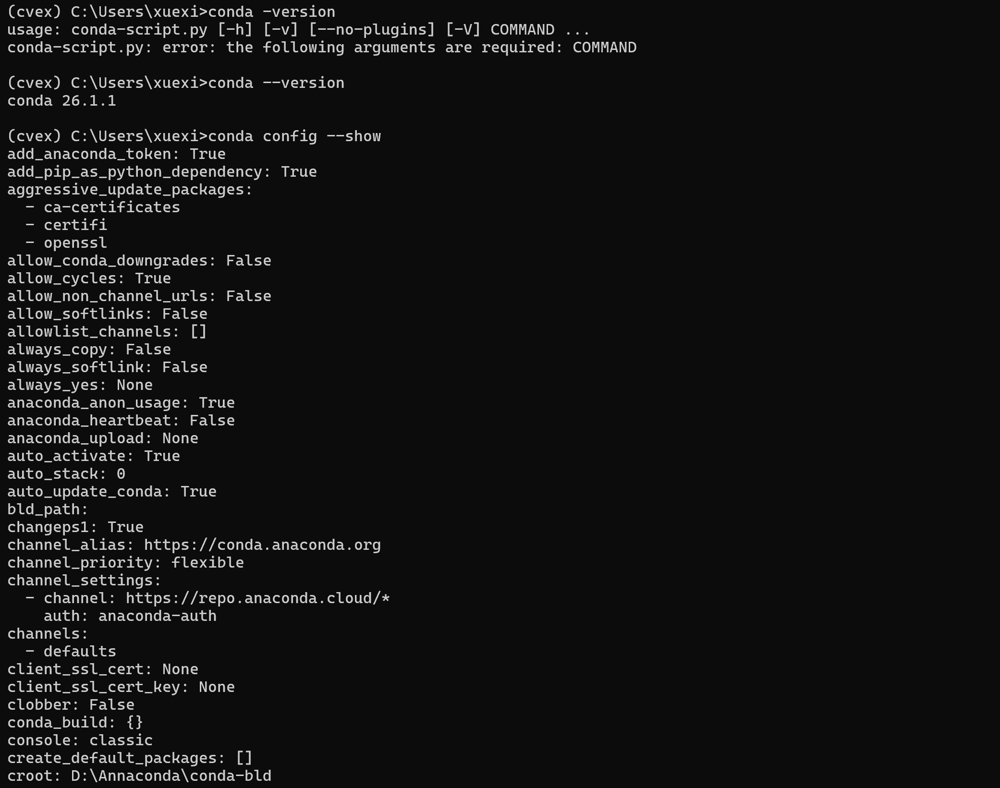
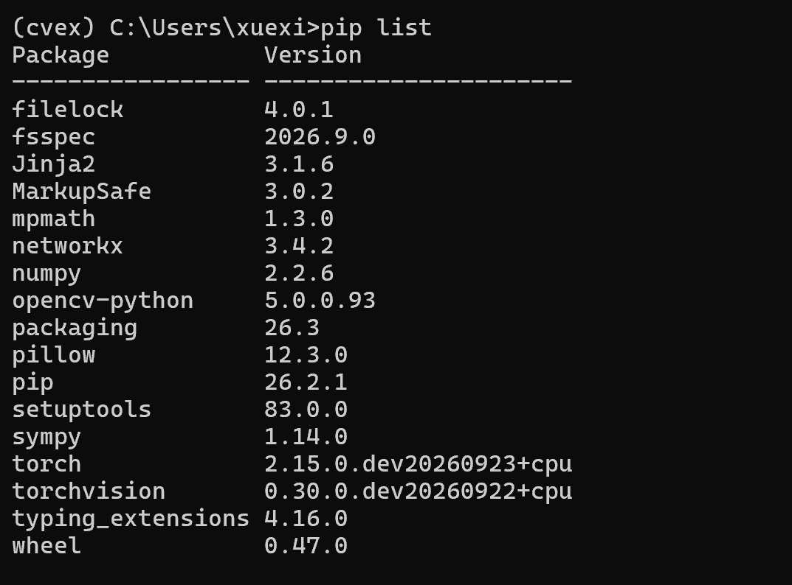
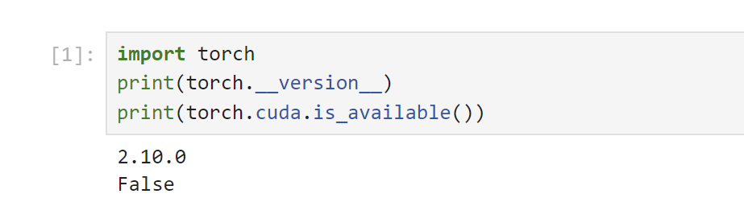
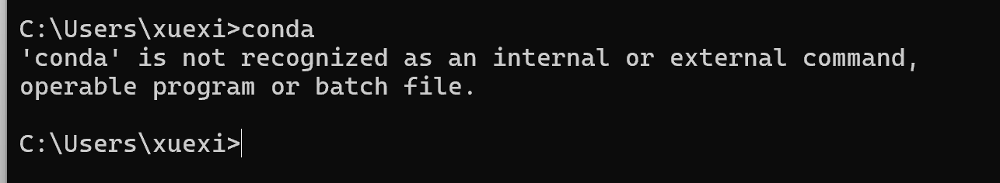

# 实验一 计算机视觉库的安装实验报告

## 一、实验目的

1. 掌握 Anaconda 的安装与基础配置方法。
2. 熟悉 conda 虚拟环境的创建、激活等基本操作。
3. 掌握无独立显卡（无 NVIDIA 显卡）环境下 PyTorch CPU 版本的安装方法。
4. 完成 OpenCV 库的安装与配置，搭建计算机视觉基础开发环境。

## 二、实验环境

| 项目 | 内容 |
| --- | --- |
| 操作系统 | Windows |
| Anaconda 版本 | 26.1.1 |
| 显卡型号 | CPU 核显 |
| CUDA Toolkit 版本 | 不安装 CUDA |
| Python 版本 | 3.10 |

## 三、实验内容与实验步骤

### 3.1 Anaconda 的安装及配置

完成 Anaconda 软件的安装，配置系统环境，验证 conda 工具是否可以正常调用。

1. 打开终端，输入命令查看 conda 版本，验证安装是否成功。

```bash
conda --version
conda config --show
```

**图1　conda 版本与配置命令运行结果**



### 3.2 conda 的基本操作与 OpenCV 的安装

1. 使用 conda 命令创建名为 `cv` 的虚拟环境，并指定 Python 版本。

```bash
conda create -n cvex python==3.10
```

2. 激活 `cv` 虚拟环境。

```bash
conda activate cvex
```

3. 在 `cv` 虚拟环境中使用 pip 安装 OpenCV 库。

```bash
pip install opencv-python
```

4. 使用 `pip list` 查看当前环境已安装的包，确认 opencv-python 安装成功。

```bash
pip list
```

**图2　创建环境并安装依赖后 pip list 包列表（含 opencv-python、torch CPU 版）**



### 3.3 GPU 加速环境配置

本机没有 NVIDIA 独立显卡，不支持 CUDA 与 cuDNN 硬件加速。

`nvidia-smi`、`nvcc --version` 命令无法执行，因此跳过 CUDA Toolkit 与 cuDNN 的下载和安装。本实验改用 PyTorch CPU 版本完成计算机视觉相关实验。

> 说明：本小节无截图，以文字说明代替。

### 3.4 PyTorch 安装

1. 由于本机无 NVIDIA 独立显卡，选择安装 PyTorch CPU 版本。
2. 在已经激活的 `cv` 虚拟环境中执行 CPU 版 PyTorch 安装命令（二选一，推荐 pip 方式）。

```bash
pip install torch torchvision --index-url https://download.pytorch.org/whl/cpu
# 或使用 conda 方式：
conda install pytorch torchvision cpuonly -c pytorch
```

3. 执行 `conda list torch` 查看 torch 相关包，确认 torch、torchvision 已经成功安装。

```bash
conda list torch
```

**图3　conda list torch 查看 torch、torchvision 安装情况**



### 3.5 PyTorch 环境验证

进入 Python 交互环境，输入如下代码，验证 PyTorch 是否可以正常导入并运行。

```python
import torch
print(torch.__version__)
print(torch.cuda.is_available())
```

> 说明：因为没有 NVIDIA 独立显卡，`torch.cuda.is_available()` 返回 `False` 属于正常现象，代表仅使用 CPU 进行运算。

> **【图片占位 4】** 此处插入 PyTorch CPU 版本验证运行截图

## 四、实验现象与问题分析

**问题 1：** 打开 cmd 输入 conda 提示 `conda is not recognized as an internal or external command`。



- **原因**：Anaconda 安装时未将 Scripts 目录添加至系统环境变量 PATH，终端无法找到 conda 可执行程序。
- **解决方法**：使用 Anaconda Prompt 终端；或者将 anaconda 的 Scripts 路径添加到系统环境变量，重启终端。

**问题 2：** 本机执行 `nvidia-smi` 命令会提示不是内部命令。

- **原因**：电脑没有 NVIDIA 独立显卡，未安装 NVIDIA 显卡驱动程序。
- **解决**：无需安装，直接使用 PyTorch CPU 版本开展实验。

## 五、实验总结

1. 简述本次实验完成的内容：完成 Anaconda 配置，掌握 conda 虚拟环境的创建、激活等操作；完成 OpenCV 库的安装；由于电脑无 NVIDIA 独立显卡，安装 PyTorch CPU 版本，完成开发环境搭建。
2. 总结 conda 虚拟环境的作用与常用操作。
3. 理解 GPU 加速的适用条件：只有配备 NVIDIA 显卡的计算机才可以使用 CUDA 加速；无独显设备可使用 CPU 版 PyTorch 完成课程学习与简单实验，但运行大型神经网络速度较慢。
